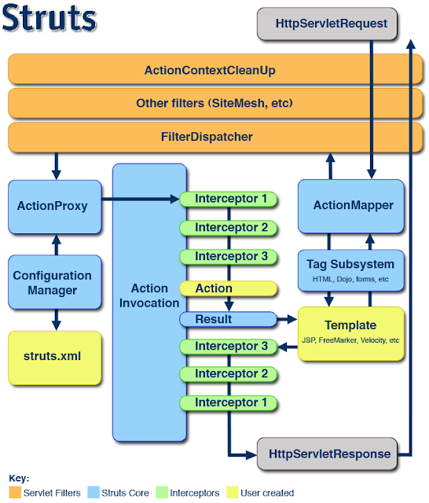
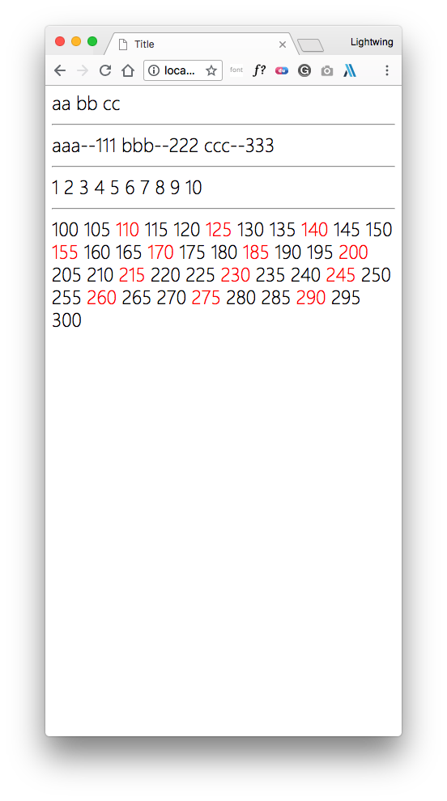
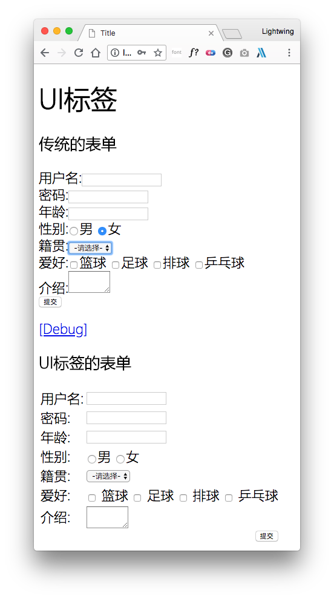

## 第 1 章 Struts2_day04 笔记

### 1.1 上次课内容回顾

#### OGNL 表达式

##### OGNL 的概述

- OGNL：对象图导航语言，是一门功能强大的表达式语言。


##### OGNL的功能

- 调用对象的方法

- 调用对象的静态方法

- 表达式串联

- 访问 `ActionContext` 和 `OgnlContext` 数据


##### OGNL独立的表达式：

- `Java` 环境下入门

- `Struts2` 环境下入门


#### 值栈

##### 值栈的概述

​	ValueStack：是一个接口，实现类 OgnlValueStack。是数据的中转站，贯穿了整个 Action，有一个 Action 的实例，就会创建一个 ValueStack 对象。

##### 值栈的内部结构

- Root：CompoundRoot，就是一个 ArrayList。
- Context：OgnlContext，就是一个 Map。

##### ActionContext 和值栈关系

- `ActionContext` 获得值栈的引用。


##### 获得值栈

- 通过 `ActionContext` 获取

- 通过 `request` 获取


##### 操作值栈

- 利用 `Action` 本身在栈中的特点，`Action` 中的属性。

- 手动操作值栈：


##### 获取值栈的数据

- OGNL 获取：`<s:property value="..."/>`


##### EL 获取值栈的数据

- 底层增强 `request.getAttribute("");`


#### ONGL 特殊字符

##### `#` 号

- 获取 `context` 数据
- 构建 `map` 集合

##### `%` 号

- 强制解析 OGNL

##### `$` 号

- 在配置文件中使用OGNL

### 1.2 `Struts2` 的拦截器（*****）

#### 1.2.1 拦截器概述

##### 1.2.1.1 什么是拦截器

###### `Interceptor`：拦截器，起到拦截 `Action` 的作用。

- `Filter`：过滤器，过滤从客户端向服务器发送的请求。

- `Interceptor`：拦截器，拦截是客户端对 `Action` 的访问。更**细粒度化**的拦截。（拦截 `Action` 中的具体的方法）。


###### `Struts2` 框架核心的功能都是依赖拦截器实现。

##### 1.2.1.2 `Struts2` 的执行流程

​	客户端向服务器发送一个 `Action` 的请求，执行核心过滤器（`doFilter`）方法。在这个方法中，调用 `executeAction()` 方法，在这个方法内部调用 `dispatcher.serviceAction();` 在这个方法内部创建一个 `Action` 代理，最终执行的是 `Action` 代理中的 `execute()`,在代理中执行的 `execute` 方法中调用`ActionInvocation` 的 `invoke` 方法。在这个方法内部递归执行一组拦截器（完成部分功能），如果没有下一个拦截器，就会执行目标 `Action`，根据 `Action` 的返回的结果进行页面跳转。



#### 1.2.2 拦截器入门：

##### 1.2.2.1 搭建 `Struts2` 的环境

##### 1.2.2.2 编写拦截器类

​	编写一个类实现 `Interceptor` 接口或者继承 `AbstractInterceptor` 类。

```java
/**
 * 自定义的拦截器1
 *
 * @author Lightwing Ng
 */
public class InterceptorDemo1 extends AbstractInterceptor {
    @Override
    public String intercept(ActionInvocation invocation) throws Exception {
        System.out.println("InterceptorDemo1执行了...");
        String obj = invocation.invoke();
        System.out.println("InterceptorDemo1执行结束了...");
        return obj;
    }
}
```

##### 1.2.2.3 对拦截器进行配置

###### 1. 定义拦截器进行配置

```xml
    <package name="demo1" extends="struts-default" namespace="/">
        <interceptors>
            <interceptor name="interceptorDemo1"
                         class="com.lightwing.web.interceptor.InterceptorDemo1"/>
            <interceptor name="interceptorDemo2"
                         class="com.lightwing.web.interceptor.InterceptorDemo2"/>
            <interceptor-stack name="myStack">
                <interceptor-ref name="defaultStack"/>
                <interceptor-ref name="interceptorDemo1"/>
                <interceptor-ref name="interceptorDemo2"/>
            </interceptor-stack>
        </interceptors>

        <action name="actionDemo1" class="com.lightwing.web.action.ActionDemo1">
            <result>/demo1/demo1.jsp</result>
            <interceptor-ref name="myStack"/>
        </action>
        <action name="uiAction" class="com.lightwing.web.action.UIAction">
            <result name="input">/demo2/demo3.jsp</result>
        </action>
    </package>
```

###### 2. 定义一个拦截器栈的方式

```xml
<interceptor-stack name="myStack">
	<interceptor-ref name="defaultStack"/>
	<interceptor-ref name="interceptorDemo1"/>
	<interceptor-ref name="interceptorDemo2"/>
</interceptor-stack>
```

### 1.3 `CRM` 的权限拦截器

#### 1.3.1 实现用户登录的功能

##### 1.3.1.1 创建表和实体

###### 1. 创建表

```sql
CREATE TABLE `sys_user` (
	`user_id` bigint(32) NOT NULL AUTO_INCREMENT COMMENT '用户id',
	`user_code` varchar(32) NOT NULL COMMENT '用户账号',
	`user_name` varchar(64) NOT NULL COMMENT '用户名称',
	`user_password` varchar(32) NOT NULL COMMENT '用户密码',
	`user_state` char(1) NOT NULL COMMENT '1:正常,0:暂停',
	PRIMARY KEY (`user_id`)
) ENGINE = InnoDB AUTO_INCREMENT = 1 CHARSET = utf8;
```

###### 2. 创建实体

```java
public class User implements org.apache.catalina.User {
    private Long user_id;
    private String user_code;
    private String user_name;
    private String user_password;
    private String user_state;
```

##### 1.3.1.2 提交数据到 `Action`

```java
package com.lightwing.web.action;

import com.lightwing.domain.User;
import com.lightwing.service.UserService;
import com.lightwing.service.impl.UserServiceImpl;
import com.opensymphony.xwork2.ActionSupport;
import com.opensymphony.xwork2.ModelDriven;
import com.opensymphony.xwork2.ActionContext;
import org.apache.struts2.ServletActionContext;

/**
 * 用户的Action的类
 *
 * @author Lightwing Ng
 */
public class UserAction extends ActionSupport implements ModelDriven<User> {
    // 接收数据:
    private User user = new User();

    @Override
    public User getModel() {
        return user;
    }

    /**
     * 用户登录的方法:
     */
    public String login() {
        System.out.println(user);
        // 调用业务层:
        UserService userService = new UserServiceImpl();
        User existUser = userService.login(user);
        // 根据结果页面跳转：
        if (existUser == null) {
            // 登录失败
            this.addActionError("用户名或密码错误！");
            return LOGIN;
        } else {
            // 登录成功
            ServletActionContext.getRequest().getSession().setAttribute("existUser", existUser);
            return SUCCESS;
        }
    }
}
```

##### 1.3.1.3 `Action -> Service -> DAO`

###### 1. 编写 `Service`

```java
/**
 * 用户的业务层的实现类
 *
 * @author Lightwing Ng
 */
public class UserServiceImpl implements UserService {
    @Override
    // 业务层用户登录的方法:
    public User login(User user) {
        UserDao userDao = new UserDaoImpl();
        return userDao.login(user);
    }
}
```

###### 2. 编写 `DAO`

```java
public class UserDaoImpl implements UserDao {
    @Override
    // 用户的DAO的登录的方法:
    public User login(User user) {
        Session session = HibernateUtils.getCurrentSession();
        Transaction tx = session.beginTransaction();
        Query query = session.createQuery("from User where user_code=? and user_password=?");
        // 设置参数:
        query.setParameter(0, user.getUser_code());
        query.setParameter(1, user.getUser_password());
        List<User> list = query.list();
        if (list.size() > 0)
            return list.get(0);

        tx.commit();
        return null;
    }

    @Override
    public User login(org.apache.catalina.User user) {
        return null;
    }
}
```

##### 1.3.1.4 根据结果进行页面跳转

```xml
        <action name="user_*" class="com.lightwing.web.action.UserAction" method="{1}">
            <result name="success" type="redirect">/index.jsp</result>
        </action>
```

#### 1.3.2 实现权限拦截器

##### 1.3.2.1 编写权限拦截器

```java
/**
 * 权限拦截器
 *
 * @author Lightwing Ng
 */
public class PrivilegeInterceptor extends MethodFilterInterceptor {
    @Override
    protected String doIntercept(ActionInvocation invocation) throws Exception {
        // 判断session中是否存在用户数据:
        User existUser = (User) ServletActionContext.getRequest().getSession().getAttribute("existUser");
        // 判断从session中获取的用户的信息是否为空:
        if (existUser == null) {
            // 没有登录
            // 给出提示信息
            ActionSupport actionSupport = (ActionSupport) invocation.getAction();
            actionSupport.addActionError("没有登录！没有权限访问！");
            // 回到登录页面
            return actionSupport.LOGIN;
        } else {
            // 已经登录
            return invocation.invoke();
        }
    }
}
```

##### 1.3.2.2 配置拦截器

```xml
<interceptor-ref name="privilegeInterceptor">
	<param name="excludeMethods">login</param>
</interceptor-ref>
<interceptor-ref name="defaultStack"/>
```

### 1.4 `Struts2` 的标签库

#### 1.4.1 通用标签库

##### 1.4.1.1 判断标签

###### `<s:if> <s:elseif> <s:else>`

```jsp
<s:set var="i" value="5" scope="request"/>
<s:if test="#request.i>3">
    i 大于 3
</s:if>
<s:elseif test="#request.i<3">
    i 小于 3
</s:elseif>
<s:else>
    i 等于 3
</s:else>
```

###### `<s:iterator>`

```jsp
<body>
<s:iterator var="i" value="{'aa', 'bb', 'cc'}">
    <s:property value="#i"/>
</s:iterator>
<hr/>
<s:iterator var="entry" value="#{'aaa': '111', 'bbb': '222', 'ccc': '333'}">
    <s:property value="#entry.key"/>--<s:property value="#entry.value"/>
</s:iterator>
<hr/>
<s:iterator var="i" begin="1" end="10" step="1">
    <s:property value="#i"/>
</s:iterator>
<hr/>
<s:iterator var="i" begin="100" end="300" step="5" status="status">
    <s:if test="#status.count % 3 == 0">
        <span style="color: red; "><s:property value="#i"/></span>
    </s:if>
    <s:else>
        <s:property value="#i"/>
    </s:else>
</s:iterator>
</body>
```



###### 其他常用的标签

- `<s:property/>`

- `<s:debug/>`

- `<s:date />`                 在页面上进行日期格式化。

```jsp
<html>
<head>
    <meta http-equiv="Content-Type" content="text/html; charset=UTF-8">
    <title>Title</title>
</head>
<body>
<h1>UI 标签</h1>
<h3>传统的表单</h3>
<form action="${ pageContext.request.contextPath }/uiAction.action" method="post">
    <input type="hidden" name="id"/>
    用户名:<label>
    <input type="text" name="name"/>
</label><br/>
    密码:<label>
    <input type="password" name="password">
</label><br/>
    年龄:<label>
    <input type="text" name="age">
</label><br/>
    性别:<label>
    <input type="radio" name="sex" value="男">
</label>男
    <label>
        <input type="radio" name="sex" value="女">
    </label>女<br/>
    籍贯:<label>
    <select name="city">
        <option value="">-请选择-</option>
        <option value="北京">北京</option>
        <option value="上海">上海</option>
        <option value="深圳">深圳</option>
        <option value="韩国">韩国</option>
    </select>
</label><br/>
    爱好:<label>
    <input type="checkbox" name="hobby" value="basketball"/>
</label>篮球
    <label>
        <input type="checkbox" name="hobby" value="football"/>
    </label>足球
    <label>
        <input type="checkbox" name="hobby" value="volleyball"/>
    </label>排球
    <label>
        <input type="checkbox" name="hobby" value="pingpang"/>
    </label>乒乓球<br/>
    介绍:<label>
    <textarea name="info" cols="8" rows="2"></textarea>
</label><br/>
    <input type="submit" value="提交"/>
</form>
<s:debug></s:debug>
<h3>UI标签的表单</h3>
<s:form action="uiAction" namespace="/" method="post">
    <s:hidden name="id"/>
    <s:textfield name="name" label="用户名"/>
    <s:password name="password" label="密码" showPassword="true"/>
    <s:textfield name="age" label="年龄"/>
    <s:radio list="{'男', '女'}" name="sex" label="性别"/>
    <s:select list="{'北京', '上海', '深圳', '韩国'}" name="city" label="籍贯" headerKey=""
              headerValue="-请选择-"/>
    <s:checkboxlist
            list="#{ 'basketball': '篮球', 'football': '足球','volleyball':'排球','pingpang':'乒乓球'}"
            name="hobby" label="爱好"/>
    <s:textarea name="info" cols="8" rows="2" label="介绍">
    </s:textarea>
    <s:submit value="提交"/>
</s:form>
</body>
</html>
```



#### 1.4.2 `UI` 标签库（方便数据回显）